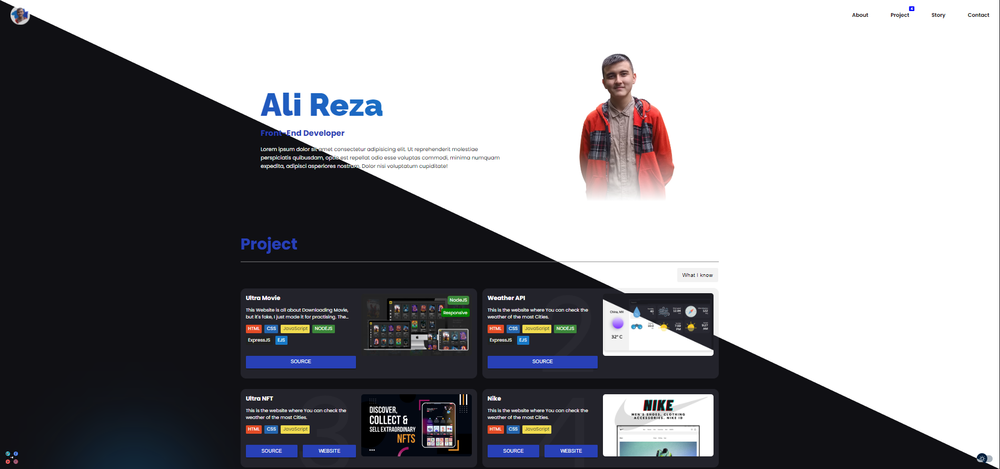

# Portfolio

I'm making my first Portfolio ever...




>**Note** <br />
> I'm still working on it...

## My process for this Project
- [x] Navbar
- [x] About
- [x] Project
- [x] Story
- [x] Contact
- [x] Footer 

## Available Scripts

In the project directory, you can run:

## Running the project

1.  Clone the repo:

    ```console
    $ git clone https://github.com/AliReza1083/Portfolio.git
    ```

2.  Navigate to the cloned directory:

    ```console
    $ cd Portfolio
    ```

3.  Install dependencies:

    ```console
    $ npm install
    ```
    ```console
    $ yarn
    ```

4.  Run the project

    ```console
    $ npm run dev
    ```
    ```console
    $ yarn dev
    ```

# Websites

- Main Branch: [https://gleaming-marshmallow-fb9096.netlify.app/](https://gleaming-marshmallow-fb9096.netlify.app/)